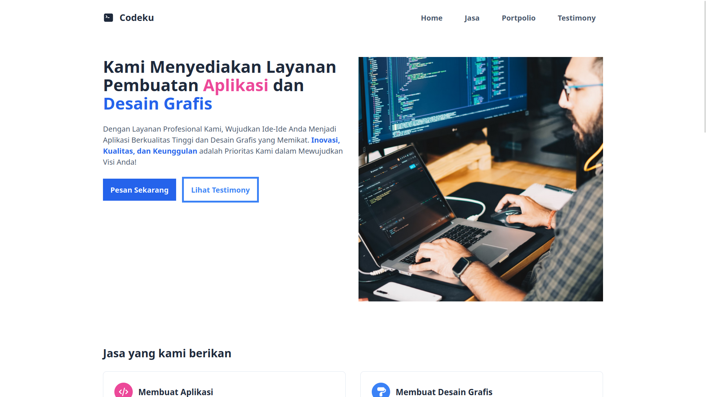
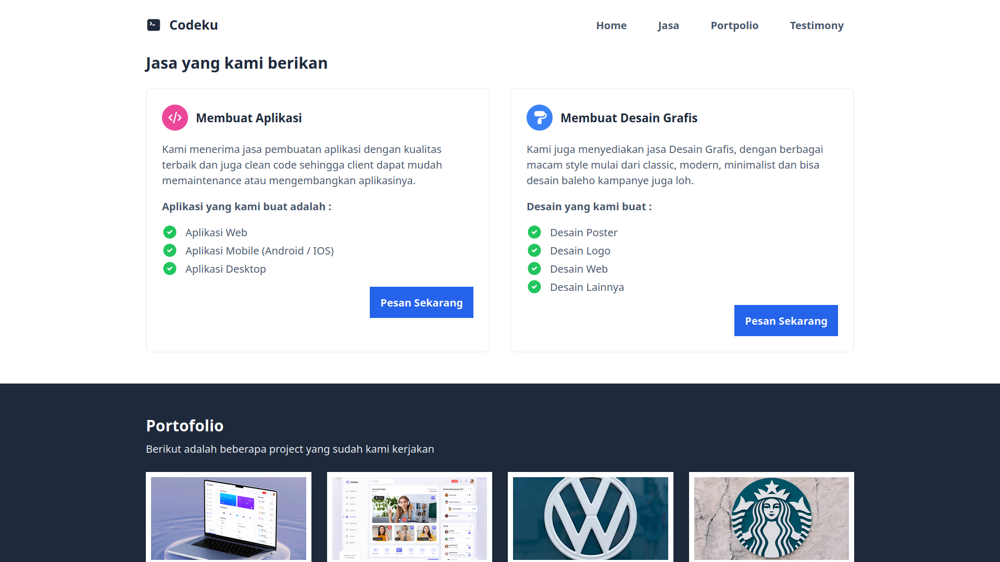
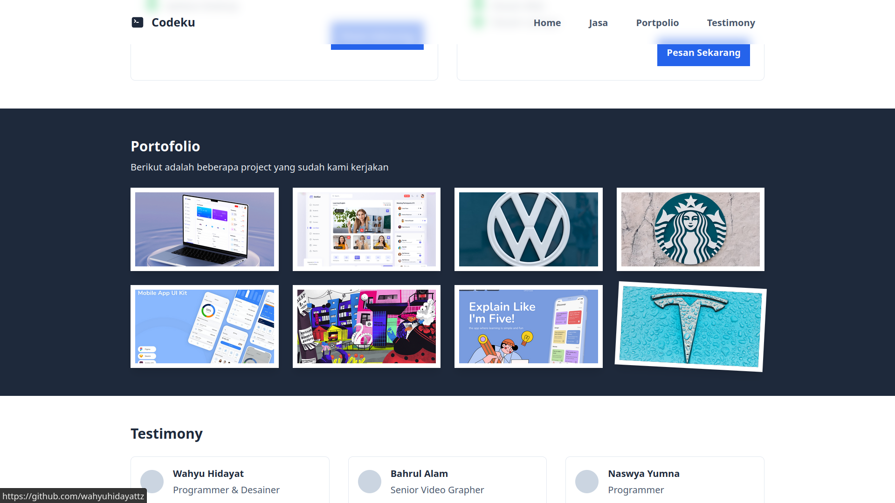
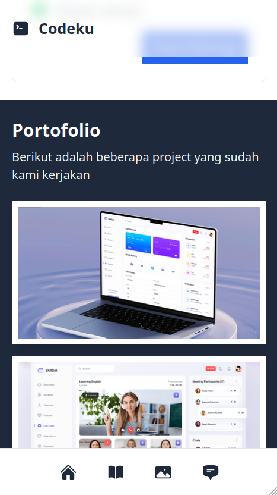

# Codeku

Codeku adalah sebuah website landing page untuk menjual jasa pembuatan Aplikasi dan Desain Grafis. 

Codeku dibuat untuk tugas kuliah Cyberpreneurship 😁

### Teknologi yang digunakan

1. HTML
2. Tailwindcss
3. Javascript (Dikit)

### Preview Webnya 

[https://wahyuhidayattz.github.io/codeku](https://wahyuhidayattz.github.io/codeku)

### Resource & Credit

- Behance - untuk screenshot projectan
- Unsplash - untuk gambar gambarnya
- Hero Icon - Untuk icon-iconnya
- Tabler Icon - Untuk icon-iconnya juga

### Screenshots

Versi Mobile

